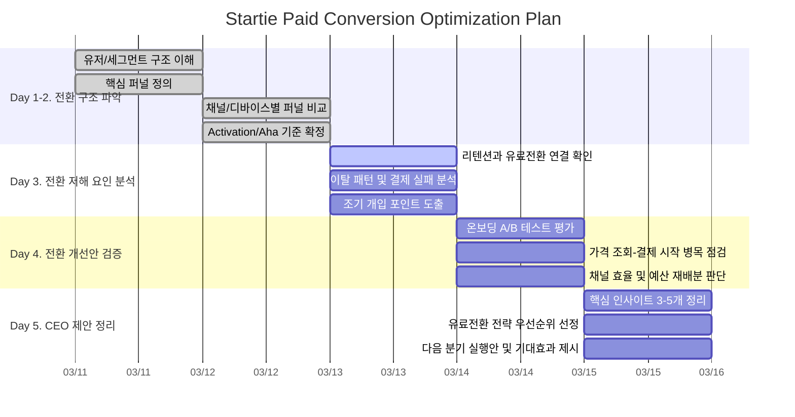

# 유료전환 최적화 발표용 간트 차트

근거 컨텍스트:
- `context/01_product_overview.md`
- `context/02_data_dictionary.md`
- `context/03_analysis_guide.md`
- `context/05_ceo_questions.md`
- `docs/meetings/2. 전체 작업 문서 (1~5일차).md`

이 문서는 차트 생산이 아니라 CEO 의사결정 지원용 일정표다.

## 발표 주제

- 주제:
  - 스타티 유료전환 최적화 전략
- 핵심 질문:
  - 무료체험 유저를 어떤 행동, 어떤 구간, 어떤 세그먼트에서 더 많이 유료로 전환시킬 수 있는가?

## 간트 차트

## 발표 흐름

### Q1. 가치와 활성화
- 질문 정의:
  - 가입 후 어떤 초기 행동이 유료전환 확률을 가장 크게 높이는가?
- 핵심 지표:
  - 활성화율, Aha 도달률, 체험판 대비 유료전환율, D7/D30 리텐션
- 사용 테이블:
  - `users`, `event_logs`, `payment_transactions`, `plan_history`
- 의사결정 기준(So What):
  - Aha 도달 유저의 전환율이 높다면 온보딩과 초기 학습 행동 유도에 우선 투자한다.

### Q3. 이탈 분석
- 질문 정의:
  - 유저는 결제 전 어디서 이탈하고, 어떤 신호에서 회복 개입이 가능한가?
- 핵심 지표:
  - 가격 페이지 이탈률, 결제 시작 후 이탈률, 결제 실패 후 이탈률, 무활동 유저 비율
- 사용 테이블:
  - `event_logs`, `payment_transactions`, `users`, `chat_events`, `push_events`
- 의사결정 기준(So What):
  - 결제 실패나 48시간 무활동이 강한 이탈 신호면 CRM/CS 개입을 자동화한다.

### Q4. A/B 테스트 평가
- 질문 정의:
  - 온보딩 개선 실험은 전사 적용할 가치가 있는가?
- 핵심 지표:
  - 온보딩 완료율 uplift, Aha 도달률 uplift, 유료전환율 uplift, p-value
- 사용 테이블:
  - `experiments`, `ab_assignment`, `event_logs`, `users`, `payment_transactions`
- 의사결정 기준(So What):
  - 통계적 유의성과 실용적 유의성이 함께 맞을 때만 확대 적용한다.

### Q2. 채널 품질
- 질문 정의:
  - 어떤 채널이 유료전환 효율이 높고, 어디에 예산을 더 써야 하는가?
- 핵심 지표:
  - CAC, LTV, LTV/CAC, 채널별 최종 전환율
- 사용 테이블:
  - `users`, `campaigns`, `payment_transactions`, `plan_history`, `event_logs`
- 의사결정 기준(So What):
  - 전환과 회수 효율이 낮은 채널은 줄이고, 높은 채널은 확대한다.

### Q5. 다음 분기 전략 집중
- 질문 정의:
  - 다음 분기에 유료전환을 가장 크게 높일 1~2개 전략은 무엇인가?
- 핵심 지표:
  - 예상 MRR 임팩트, 실행 난이도, 적용 속도, 리스크
- 사용 테이블:
  - Q1~Q4 요약 결과
- 의사결정 기준(So What):
  - 매출 임팩트와 실행 가능성을 같이 점수화해 우선순위를 결정한다.

## 최종 메시지 구조

- What:
  - 유료전환은 초기 가치 경험과 결제 직전 병목에서 크게 갈린다.
- Why:
  - Aha 도달 전 이탈, 가격 페이지 이후 이탈, 결제 실패 복구 부족이 핵심 원인이다.
- So What:
  - 온보딩 개선, 체크아웃 개선, 실패 결제 회복 자동화, 채널 재배분을 우선 실행한다.
- Impact:
  - 전환율 상승과 이탈 감소를 통해 다음 분기 MRR 개선을 목표로 한다.
